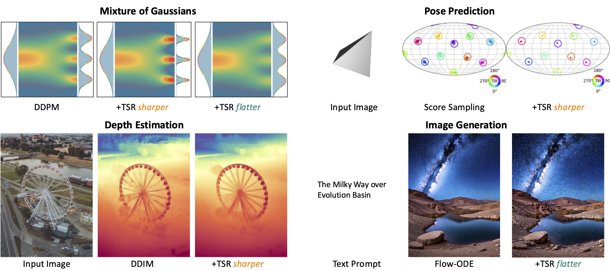

# TSR

This repository contains the official implementation for **Temporal Score Rescaling for Temperature Sampling in Diffusion and Flow Models**. 


## Introduction

We present a training-free mechanism (**TSR**) to **steer the sampling diversity** of denoising diffusion and flow matching models, allowing users to sample from a sharper or broader
distribution than the training distribution. We validate its effectiveness on 2D toy data and demonstrate its applicability to real-world tasks.



## Diffusers Integration

**TSR** is compatible with [Diffusers](https://github.com/huggingface/diffusers), making it easy to integrate into a wide range of existing codebases. 

We provide an example of text-to-image generation with both [Stable Diffusion 2](https://huggingface.co/stabilityai/stable-diffusion-2) and [Stable Diffusion 3](https://huggingface.co/stabilityai/stable-diffusion-3-medium). For a demonstration, please refer to t2img_demo.ipynb.


### Install

1. Clone TSR:

```bash
git clone https://github.com/temporalscorerescaling/TSR.git
cd TSR
```

2. Create the environment and install packages:

```bash
conda create -n TSR python=3.9
conda activate TSR

### torch
# CUDA 11.8
pip install torch==2.5.1 torchvision==0.20.1 torchaudio==2.5.1 --index-url https://download.pytorch.org/whl/cu118

pip install transformers

### diffusers
pip install -U diffusers
```
Note:

- Tested on: Linux with torch 2.5.1 & CUDA 11.8 on A5000 GPUs.
- Recent versions of Diffusers require PyTorch ≥ 2.5.0. 
- For troubleshooting and information on model weights, please refer to [Stable Diffusion 3](https://huggingface.co/stabilityai/stable-diffusion-3-medium). 


## 2D Experiment

We also validate the effectiveness of **TSR** using 2D data, and provide the code to reproduce the results from the paper. Currently, Swiss Roll and Checkerboard datasets are supported, with the trained checkpoints for the corresponding flow models available in the "output" folder.


To run 2D Inference:
```bash
# Sample on trained swissroll flow model with k=10.0
python toy_sample.py --data "swissroll" --model_type "flow" --k 10.0 

# Sample on trained swissroll checkerboard model with k=10.0 and sigma=0.1
python toy_sample.py --data "checkerboard" --model_type "flow" --k 10.0 --sigma 0.1
```

To train diffusion/flow models by yourself:
```bash
# Train diffusion model on swissroll Dataset
python toy_train.py --data "swissroll" --model_type "diffusion" 

# Train flow model on swissroll Dataset
python toy_train.py --data "swissroll" --model_type "flow" 
```

